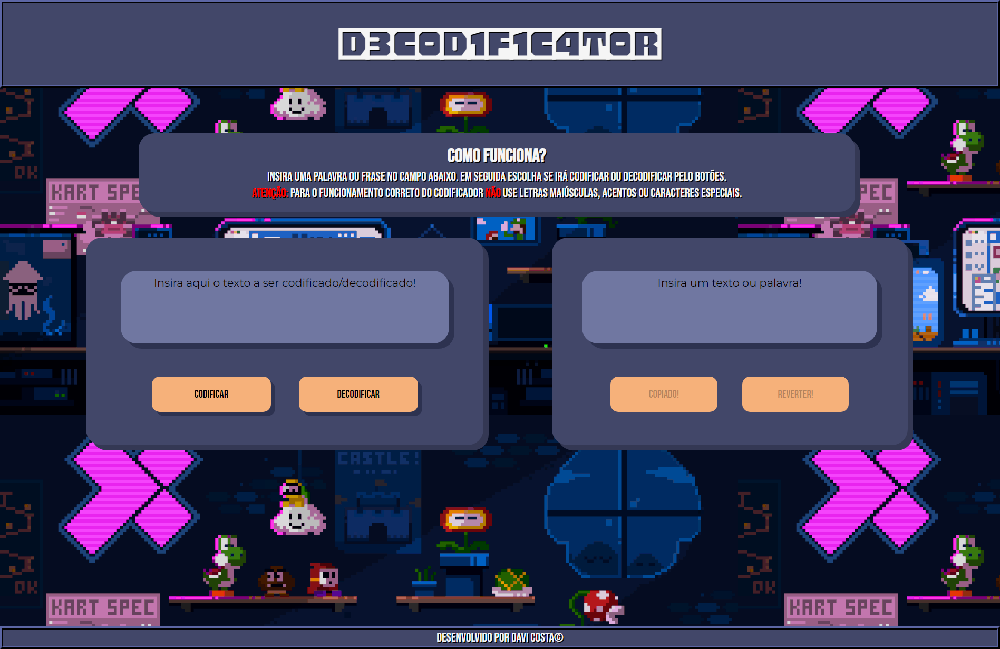
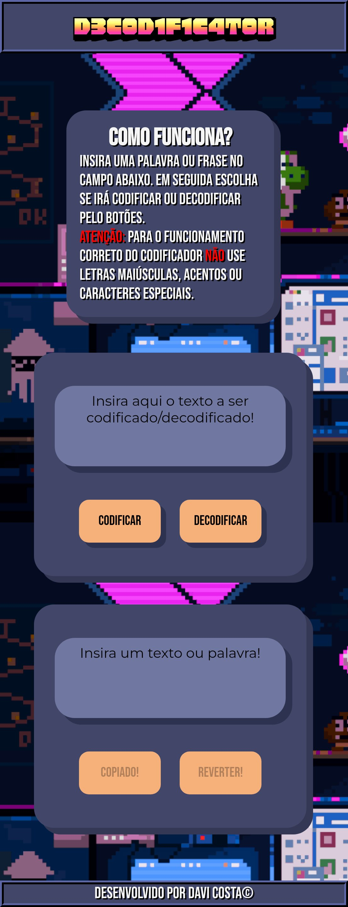

# Projeto de codificador de texto com JavaScript
Projeto realizado durante programa ONE (Oracle Next Education) com o objetivo de praticar os fudamentos das linguagens de marcação e JavaScript através de um codificador simples de texto.
## Linguagens e ferramentas utilizadas:

## [Clique aqui para testar!](https://projeto-de-codificador.vercel.app)
## Responsividade:
| Responsividade no desktop (1920x1080) | Responsividade no mobile (2340x1080) |
|----------|----------|
|  |  |

